# 📄 DocScan - Document Scanning and Matching System

A self-contained document scanning and matching system with a built-in credit system. Each user has a daily limit of 20 free scans, with additional scans requiring admin approval.

## ✨ Features

- 🔐 User Authentication (Register/Login)
- 👥 Role-based access (User/Admin)
- 💯 Credit system with daily free credits
- 🔍 Document scanning and similarity matching
- 📊 Analytics dashboard for admins
- ✅ Credit request and approval system

## 🚀 Installation

1. Ensure you have Node.js installed (v14+ recommended)
2. Clone or download this repository
3. Navigate to the project directory
4. Install dependencies:
   ```
   npm install
   ```
5. Start the application:
   ```
   npm start
   ```
6. Access the application at `http://localhost:3000`

## 📁 Project Structure

```
/DocScan
├── /assets                     # Images
│
├── /database                   # JSON Data Storage
│   ├── creditRequests.json     # credit request
│   ├── scans.json              # scans
│   ├── system_logs.json        # system logs
│   └── users.json              # userserver
│
├── /frontend                   # Client-side code
│   ├── app.js                  # JavaScript files
│   ├── index.html              # HTML templates
│   └── styles.css              # Stylesheets
│
├── /routes                     # Routes
│   ├── admin.js                # admin routes
│   ├── auth.js                 # auth routes
│   ├── credits.js              # credits routes
│   ├── scan.js                 # scan routes
│   └── user.js                 # user routes
│
├── /stored_documents           # Stored Documents
│
├── /uploaded_documents         # Uploaded Documents
│
├── /utils                      # Utility Functions
│   ├── creditReset.js          # Credit Utility Function
│   ├── hash.js                 # Hash Utility Function
│   └── textMatch.js            # Text Match Algorithms Utility Function
│
├── package-lock.json           # Peer-Dependencies
├── package.json                # Dependencies
└── README.md                   # Documentation
└── server.js                   # Server
```

## 💻 Tech Stack

- **Frontend**: 🌐 Plain HTML, CSS, and JavaScript (no frameworks)
- **Backend**: ⚙️ Node.js with Express.js
- **Database**: 💾 Local JSON files (no external database required)
- **Authentication**: 🔒 Custom username/password with hashed storage
- **Text Matching**: 🧠 Custom algorithm using Levenshtein distance and word frequency analysis

## 🔌 API Endpoints

| Method | Endpoint               | Description                             | Auth Required |
| ------ | ---------------------- | --------------------------------------- | ------------- |
| POST   | /auth/register         | Register a new user                     | No            |
| POST   | /auth/login            | User login (session-based)              | No            |
| GET    | /user/profile          | Get user profile and credits            | Yes           |
| POST   | /scan                  | Upload document for scanning (1 credit) | Yes           |
| GET    | /matches/:docId        | Get matching documents                  | Yes           |
| POST   | /credits/request       | Request additional credits              | Yes           |
| GET    | /admin/analytics       | Get admin analytics dashboard           | Yes (Admin)   |
| PUT    | /admin/credits/:userId | Approve/deny credit requests            | Yes (Admin)   |

## 💰 Credit System Implementation

### ✨ Daily Free Credits

- 🕛 Every user automatically receives 20 free credits at midnight (local time)
- 🔄 Credits reset daily
- ➖ Credits are deducted upon successful document scan (1 credit per scan)

### 🎁 Additional Credits

- 📝 Users can request additional credits when they run out
- 👨‍💼 Admins can approve or deny these requests through the admin dashboard
- 📈 Credit usage is tracked and viewable in the analytics dashboard

## 🔍 Document Scanning & Matching

The system uses a custom text similarity algorithm combining:

- ↔️ Levenshtein distance for character-level similarity
- 📊 Term frequency analysis for content matching
- 🔤 Word pattern recognition

Documents are stored locally and indexed for faster retrieval and comparison.

## 🔒 Security Features

- 🔑 Password hashing using Node.js crypto library
- 🛡️ Session-based authentication
- 🚦 Role-based access control
- ✅ Input validation and sanitization

## Images

1. Register Page: (For Users)
   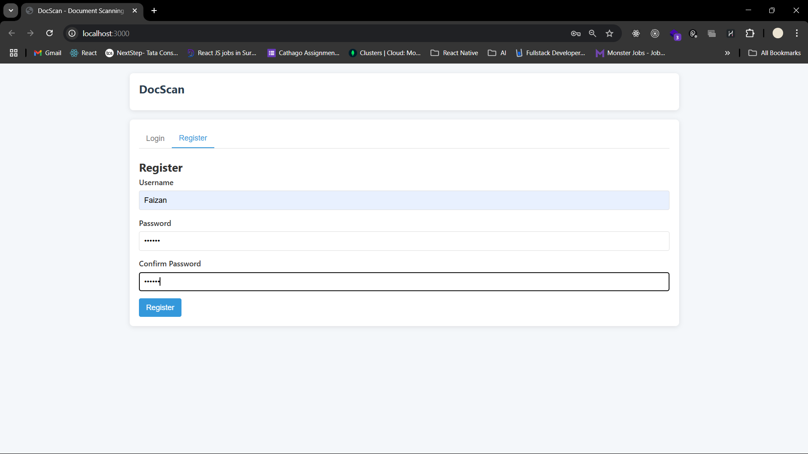

2. Home Page:
   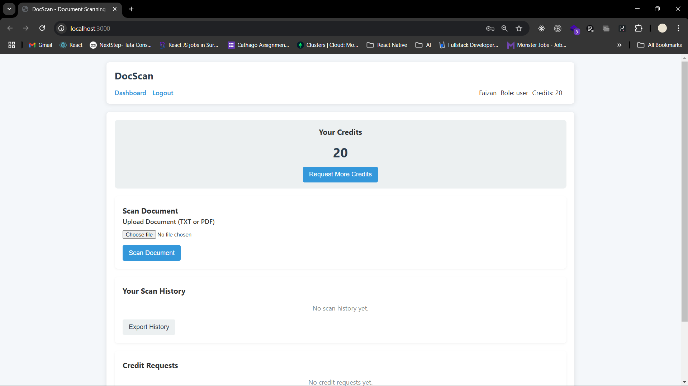

3. Upload Document to Scan:
   

4. Processing:
   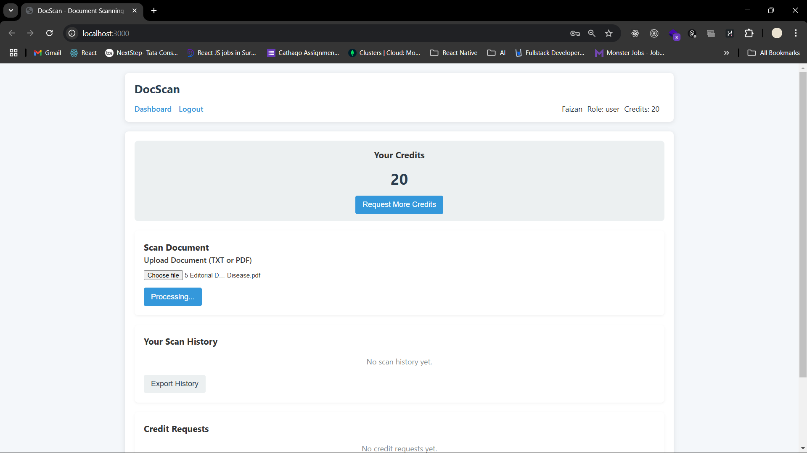

5. Result:
   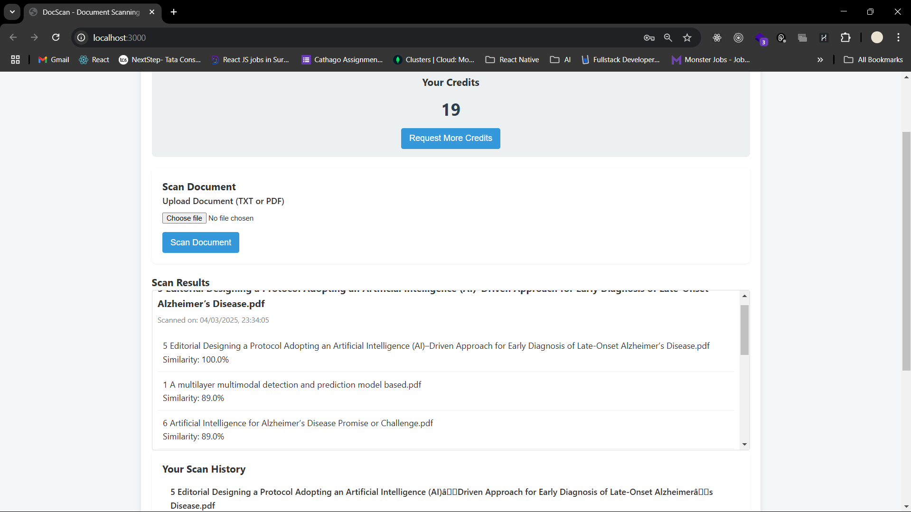

6. Credit Request:
   

7. Sucess Message:
   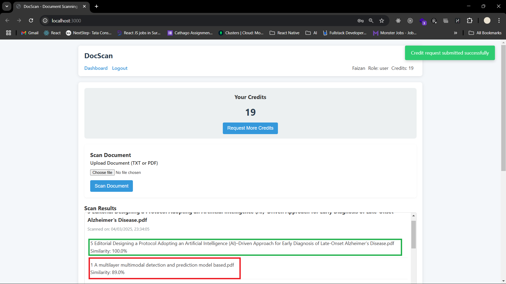

8. Login Page:
   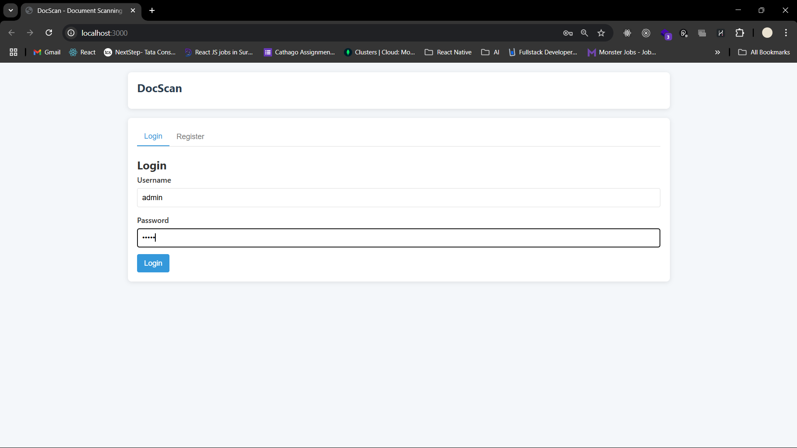

9. Admin Page:
   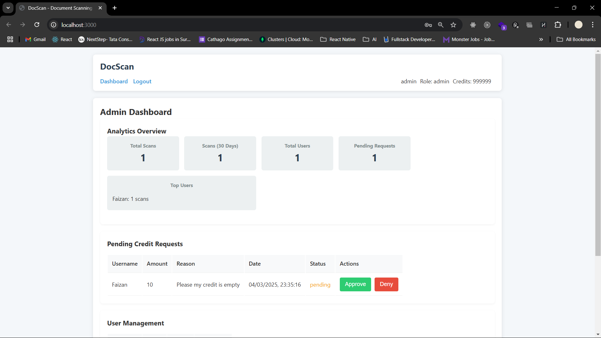

10. Dashboard:
    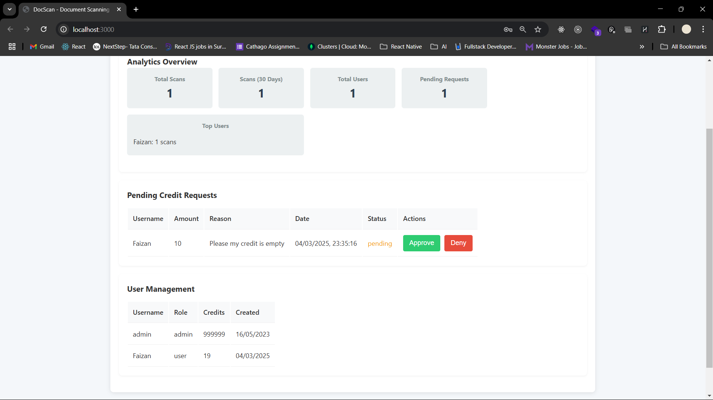

11. Same Algorithm Results (Chat gpt, Gemini, Per, Perplexity):
    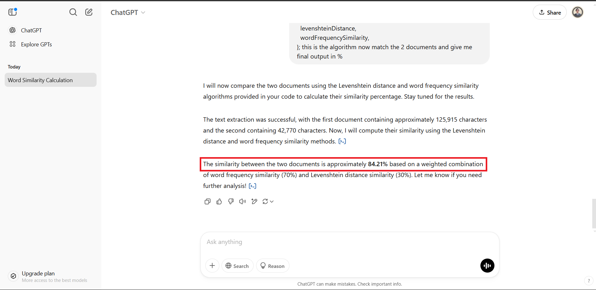
    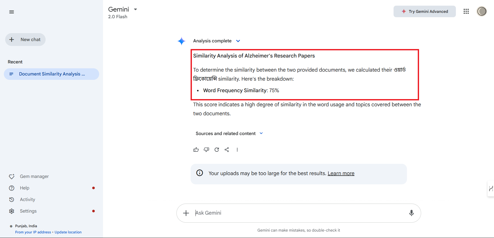
    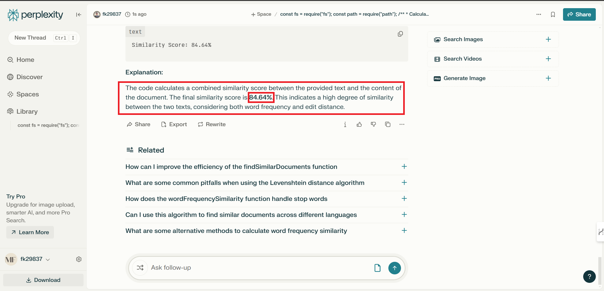

## 🧪 Testing

Sample documents are included in the `/test-data` directory for testing the scanning functionality.

To run tests:

```
npm test
```

## 👨‍💻 Development

To run in development mode with auto-reload:

```
npm run dev
```

## 📜 License

This project is for educational purposes only. All rights reserved.
